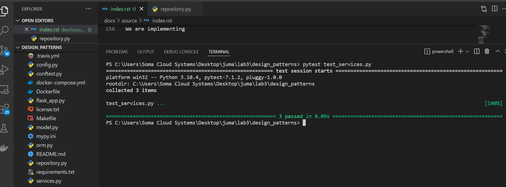

.. Repository Design Pattern documentation master file, created by
   sphinx-quickstart on Thu Jun  9 00:55:22 2022.
   You can adapt this file completely to your liking, but it should at least
   contain the root `toctree` directive.

Welcome to Repository Design Pattern's documentation!
=====================================================

.. toctree::
   :maxdepth: 2
   :caption: Contents:
================
   Title: Repository Design Pattern
================

   This a exploration of the repository design pattern by using a non-database method, for this case
   we chose file serialization using the pickle module in python. The file contains serialized file objects 
   which can be deserialised on demand and retain all the required data and meta data
================
   Abstract
================
   The aim of the lab session is to establish if our code breaks in the service layer if
   we change the storage infrustructure.
   This is important because a good design should have a decouple business logic, service logic and storage infrustructure
================
   Introduction
================
   Repositories are classes or components that encapsulate the logic required to access data sources.
   They centralize common data access functionality, providing better maintainability and 
   decoupling the infrastructure or technology used to access databases from the domain model layer.
   Service layer is an architectural pattern, applied within the service-orientation design paradigm,
   which aims to organize the services, within a service inventory, into a set of logical layers.
   The objective of this lab session is is to explore a case study of when the repository design pattern is applied 
   to non-database storage. The aim being to see if there any break in the logic.
   For that we are implementing a PickleRepository class that will handle object storage to a file and perform 
   CRUD operation just like a normal database and see if our code breaks.
================
Materials and Methods
================

To determine our case study, we under the repository module we created a class PickleRepository. This calss inherits
from an abstract class thas has three abstract methods which have to be overidded to provide interface to storing
data to any storage infrastructure, in our case its a file.
----------
add method
----------

This method receives a storage item, and adds it the storage infrastructure.
In our case, it receives a batch object, checks if the path to storage file is empty, if so, it creates a new pickle
dump file and appends the Batch item there, otherwise and creates a temporary varible that hold previous 
items in the pickle file as a list,thena adds the new Batch item. The old pickle file is deleted, and a new 
dumped with the updated Batch list
----------
get method
----------
The get method parametor, reference. This is used to query the pickle file if its contains a Batch object
with the given reference. It returns exactly one item. It load the pickle file into a python list, then uses a for
loop to check if there is a Batch object with such reference, otherwise returns None object

----------
list method
----------
The list method is used to query all the Batch objects stored in the pickle file.
It loads all the pickle file, and assigns it to a python list. It returns a list of Batch objects

``
import abc
import model
import pickle
import os

class AbstractRepository(abc.ABC):
    @abc.abstractmethod
    def add(self, batch: model.Batch):
        raise NotImplementedError

    @abc.abstractmethod
    def get(self, reference) -> model.Batch:
        raise NotImplementedError

class SqlAlchemyRepository(AbstractRepository):
    def __init__(self, session):
        self.session = session

    def add(self, batch):
        self.session.add(batch)

    def get(self, reference):
        return self.session.query(model.Batch).filter_by(reference=reference).one()

    def list(self):
        return self.session.query(model.Batch).all()

    
class PickleRepository(AbstractRepository):
       
       def __init__(self,path=None) -> None:
           self.path=path
           #create a dump of an empty list
          
           
           
           
       def add(self, batch):
           #open the dump, add the items at the end  uising + operator
           updated_items=[]
           with open(self.path, 'wb') as p:
               if  os.path.getsize(self.path) == 0:
                   pickle.dump(batch, p)
                   p.close()
                   updated_items.append(batch)
               else:
                    items = pickle.load(p)
                    updated_items=items.append(batch)
                    p.close()
           #delete the older pickle file and dump a new one with the new list in memory
           os.remove(self.path)
           with open(self.path, 'wb') as p1:
                pickle.dump(updated_items, p1)
                p1.close()

       def get(self, reference):
           with open(self.path, 'rb') as p:
               items = pickle.load(p)
               p.close()
               for e in items:
                  if e.reference==reference:
                     return e 
           
           return None

       def list(self):
           #read pickle file
           with open(self.path, 'rb') as p:
           #load list items
                 items=pickle.load(p)
                 #close file
                 p.close()
                 print(items)
                 return items
             
           
#p= PickleRepository("stock.pkl")
##print(len(p.list())) ``

.. raw:: html

    <embed>
        <iframe width="560" height="315"  frameborder="0" allowfullscreen>
        <a class="video-link" href="video.mp4" data-width="1920" data-height="1080">Open video</a>
        </iframe>
   
    </embed>
================
   Title: Repository Design Pattern
================
================
   Questions
================
   1 What is the difference between the textbook test services.py and my test services.py?
  The test book test services is an interface and relies on flask framework to work while the other one is
  custom for testing a new idea
2 Has the service layer been affected after we have chosen to use another implementation for the Repository Pattern? 
 Can we say that the service layer is ignorant of the persistence? 
   Yes the service layer has been affected, since there service which are tightly coupled with the database
   base service layer and its repository
3  What is the benefit of separating business logic from infrastructure concerns? Where is the business
    logic defined, and where is the infrastructure defined? Tell me the Python file name(s).
    Its because very easy to maintain the code and aslo to expand it when new features are needed without 
    breaking the code 

 
================
   Conclusion
================
The Conclusion here is, its important to keep business logic and the storage code
decoupled. Also when implemting a repository interface, you should keep an 
open mind to all the different storage infrustructure that could be available

Indices and tables
==================

* :ref:`genindex`
* :ref:`modindex`
* :ref:`search`

Persistence Ignorance
We are implementing 